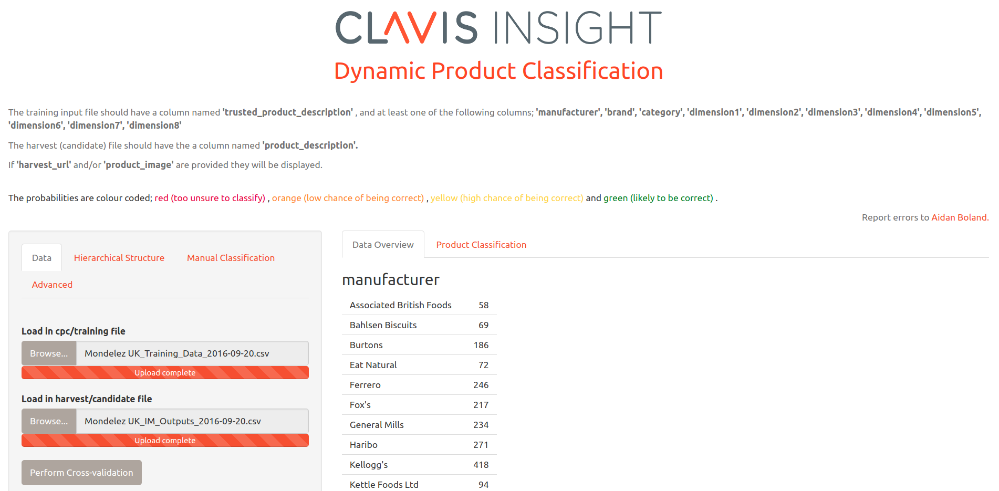
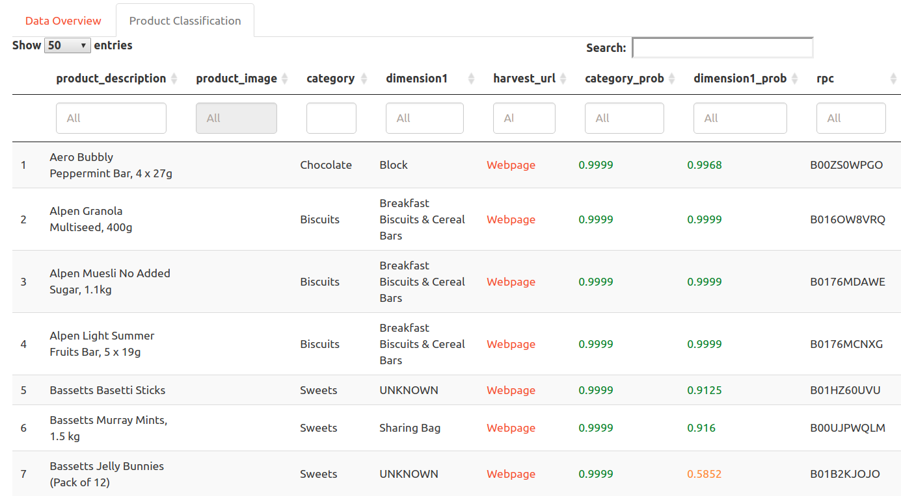

<!-- postr::render("poster/casi_2018.html", poster_width = 841) -->
<head>

</head>

## Header row {data-height=15}

###

<table style="width:100%">
<tr>
  <td rowspan="2" width="33.3%">
  </img>
  </td>
  
  <td width="33.3%">
  
<h3>
  [**Aidan Boland**](http://aboland.ie)
  </h3>

  </td>
  
  <td rowspan="2" width="33.3%">
  </img>
  </td>
</tr>
<tr><td>

  <!-- [**aboland.ie/casi18**](http://aboland.ie) -->
  
</td>
</tr>
</table> 

**Abstract**  
In industry, bringing an algorithm from it's research phase into a usable product can be an awkward hurdle to cross. During research the algorithm may be coded in one language, but in practice it may need to be used within a different language environment. It's often not worthwhile re-writing the function.  
This case study discusses the methods used to bring a statistical algorithm written in R from it's research phase, into daily use within a production environment. The algorithm in question is a supervised classification method and is used to automatically categorise e-commerce products from online stores.  
R's ecosystem makes it very simple to provide access to code without the end user needing any knowledge of R. These same methods can be used in academia to open up quick and easy access to new statistical methods.

## Body row {data-height=82}

### **Case Study Overview**

#### Clavis Insight

Clavis Insight are a leading firm in e-commerce analytics. We process large amounts of data from online stores across the globe every day; this allows our clients to monitor their performance in the online marketplace.

<figure>

</figure>

#### Classification of Products

Clients want to see performance of their products across various categories and groupings. Each client has their own version and breakdown of categories. In order to present the data in this format, we must tag each product with its correct category. A large number of new products are surfaced each day and so it is not feasible to categorise the products manually.  

<figure>

</figure>

It is possible to use supervised classification to categorise the new products. The product descriptions from the products already in the database can be used to learn about the categories. New products can then be tagged with a category automatically.

#### Bringing Auto-Classification Into Use

The code to perform supervised classification was written in R. This is useful for someone who is comfortable with the language but not useful otherwise. To bring auto-classification into general use took two steps.  
First a [shiny](https://shiny.rstudio.com/) application was built. This allowed users to load in files and perform classification using a GUI. No prior knowledge of classification techniques or coding experience was necessary for the user.  
Second the code was built into the production environment. This meant that auto-classification would run automatically as new data was loaded into the system. Since the production environment was written in Java, a suitable method was needed in order to run the R code in production. A web API for the R code was created using the [plumber](https://www.rplumber.io/) library.

### **Shiny Web Application**

[Shiny](https://shiny.rstudio.com/) is an R package that makes it easy to build interactive web applications straight from R.  

Users of the web apps do not need any experience in coding. This makes shiny a very useful method for allowing users to run algorithms with point and click.

#### Auto-Classification Using Shiny

<figure>

</figure>

 

The code for performing auto-classification was built into a simple shiny application. Anybody could upload a training file and a file with new products. The new products were then automatically classified in the application. This was all achieved with a graphical interface, the user never saw any of the underlying code and no knowledge of classification methods was needed.  

#### Shiny Workflow

1. Load in training data csv file.
1. Load in new data csv file.
1. Classify the new data within the shiny app.
1. Download classified data.
1. Upload classified data to database. 

<figure>

</figure>

 

This was a very useful application. It removed a large amount of the manual work involved with classifying products. However, it didn't fully remove manual intervention, a person had to upload files for every single customer. The next step was to fully automate the classification process.

### **plumber API**

The [plumber](https://www.rplumber.io/) package makes it very easy to convert R functions to a web application programming interface (API). This allows R functions to be called in a very versatile manner. API's can be called from almost any computer language.  

The R code can be built as a [Docker](https://www.docker.com/) container. This is essentially a version of the code which can be easily run on an external server. The address of the server will be the endpoint for the web API.  

Calling the web address of the server with the API name will run the R function. Arguments and data can be passed as part of the call to the API. Response messages and data can be passed back from the API.  

<!-- Using this method, R code can be placed into a production environment.   -->

#### Plumber Workflow

1. The data is imported and stored in a temporary database. Java code performs these tasks.

<figure>

<!-- <figcaption>Data is imported using Java code</figcaption> -->
</figure>

 
1. The API is called, the location of the temporary database is passed as an argument to the API.

<figure>

<!-- <figcaption>API called from Java</figcaption> -->
</figure>

 
1. The R code classifies the data. When finished, a message is passed back to the Java code. The data is then transferred into the production database.

<figure>

<!-- <figcaption>R code runs auto classification</figcaption> -->
</figure>

## Footer row {data-height=3} 

### {data-width=50}

<!-- #### Links -->

**Sample Shiny App**  
[casi18shiny.aboland.ie](http://casi18shiny.aboland.ie/)  
 
**Sample API Calls**  
<!-- [casi18plumber.aboland.ie/rnorm?50](http://casi18plumber.aboland.ie/rnorm?50)   -->
[casi18plumber.aboland.ie/rnorm?n=5](http://casi18plumber.aboland.ie/rnorm?n=5)  
[casi18plumber.aboland.ie/rnorm_plot?n=50](http://casi18plumber.aboland.ie/rnorm_plot?n=50)

### {data-width=50 .small}

#### References 

Chang W., Cheng J., Allaire JJ., Xie Y. and McPherson J. (2017). *Shiny: Web Application Framework for R.* [https://shiny.rstudio.com/](https://shiny.rstudio.com/)  

Trestle Technology, LLC (2017). *Plumber: An API Generator for R.* [https://www.rplumber.io/](https://www.rplumber.io/)

#### Source Code 

[github.com/aboland/CASI_2018](https://github.com/aboland/CASI_2018)

